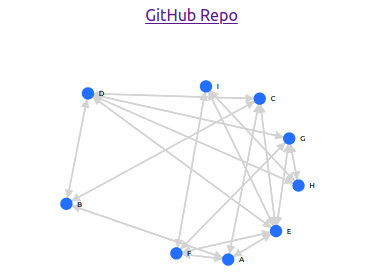

# Redis Graph Visualisation
[__redisgraph__](https://oss.redislabs.com/redisgraph/) is a __highly performant graph database__ that runs in memory and can be accessed using the __Cypher query language__. This is an open source tool, built with __React js__ and __Express backend__ to visualise this graph data. We shall be looking at how to set it up.



__Note that this entire process was done on ubuntu.__

## Step 1: Set up redisgraph

You need __docker__ installed for this step. If not, then follow [this guide](https://phoenixnap.com/kb/how-to-install-docker-on-ubuntu-18-04).
Next, you need to set up Redis-server and cli. For this, follow steps 1 and 2 of [this guide](https://www.digitalocean.com/community/tutorials/how-to-install-and-secure-redis-on-ubuntu-18-04).

__Ensure that you stop the redis server after testing it. We need the port free for the redisgraph server.__

Next. Run this command to start a redisgraph server.
~~~
sudo docker run -p 6379:6379 -it --rm redislabs/redisgraph
~~~
You should get an output like this:
~~~
1:C 23 Mar 2020 11:57:36.977 # oO0OoO0OoO0Oo Redis is starting oO0OoO0OoO0Oo
1:C 23 Mar 2020 11:57:36.977 # Redis version=5.0.8, bits=64, commit=00000000, modified=0, pid=1, just started
1:C 23 Mar 2020 11:57:36.978 # Configuration loaded
                _._                                                  
           _.-``__ ''-._                                             
      _.-``    `.  `_.  ''-._           Redis 5.0.8 (00000000/0) 64 bit
  .-`` .-```.  ```\/    _.,_ ''-._                                   
 (    '      ,       .-`  | `,    )     Running in standalone mode
 |`-._`-...-` __...-.``-._|'` _.-'|     Port: 6379
 |    `-._   `._    /     _.-'    |     PID: 1
  `-._    `-._  `-./  _.-'    _.-'                                   
 |`-._`-._    `-.__.-'    _.-'_.-'|                                  
 |    `-._`-._        _.-'_.-'    |           http://redis.io        
  `-._    `-._`-.__.-'_.-'    _.-'                                   
 |`-._`-._    `-.__.-'    _.-'_.-'|                                  
 |    `-._`-._        _.-'_.-'    |                                  
  `-._    `-._`-.__.-'_.-'    _.-'                                   
      `-._    `-.__.-'    _.-'                                       
          `-._        _.-'                                           
              `-.__.-'                                               

1:M 23 Mar 2020 11:57:36.983 # WARNING: The TCP backlog setting of 511 cannot be enforced because /proc/sys/net/core/somaxconn is set to the lower value of 128.
1:M 23 Mar 2020 11:57:36.983 # Server initialized
1:M 23 Mar 2020 11:57:36.983 # WARNING overcommit_memory is set to 0! Background save may fail under low memory condition. To fix this issue add 'vm.overcommit_memory = 1' to /etc/sysctl.conf and then reboot or run the command 'sysctl vm.overcommit_memory=1' for this to take effect.
1:M 23 Mar 2020 11:57:36.983 # WARNING you have Transparent Huge Pages (THP) support enabled in your kernel. This will create latency and memory usage issues with Redis. To fix this issue run the command 'echo never > /sys/kernel/mm/transparent_hugepage/enabled' as root, and add it to your /etc/rc.local in order to retain the setting after a reboot. Redis must be restarted after THP is disabled.
1:M 23 Mar 2020 11:57:36.999 * <graph> Thread pool created, using 1 threads.
1:M 23 Mar 2020 11:57:36.999 * Module 'graph' loaded from /usr/lib/redis/modules/redisgraph.so
1:M 23 Mar 2020 11:57:36.999 * Ready to accept connections

~~~
Just like that, Your database is set up and running!

## Step 2: Making the graph:
We shall be making a __simple directed graph__ for visualisation, using the __redis-cli__.
First run:
~~~
redis-cli
~~~
You should enter a cli tool that looks like this:
~~~
127.0.0.1:6379> 
~~~
Next, we run the following commands in the redis-cli to create a sample graph (or create you own)
~~~
GRAPH.QUERY graph "CREATE (:node{id:'A'})"
GRAPH.QUERY graph "CREATE (:node{id:'B'})"
GRAPH.QUERY graph "CREATE (:node{id:'C'})"
GRAPH.QUERY graph "CREATE (:node{id:'D'})"
GRAPH.QUERY graph "CREATE (:node{id:'E'})"
GRAPH.QUERY graph "CREATE (:node{id:'F'})"
GRAPH.QUERY graph "CREATE (:node{id:'G'})"
GRAPH.QUERY graph "CREATE (:node{id:'H'})"
GRAPH.QUERY graph "CREATE (:node{id:'I'})"
GRAPH.QUERY graph "MATCH (a:node), (b:node) WHERE (a.id = 'A' AND b.id='B') CREATE (a)-[:connectedto]->(b)"
GRAPH.QUERY graph "MATCH (a:node), (b:node) WHERE (a.id = 'A' AND b.id='C') CREATE (a)-[:connectedto]->(b)"
GRAPH.QUERY graph "MATCH (a:node), (b:node) WHERE (a.id = 'C' AND b.id='B') CREATE (a)-[:connectedto]->(b)"
GRAPH.QUERY graph "MATCH (a:node), (b:node) WHERE (a.id = 'B' AND b.id='C') CREATE (a)-[:connectedto]->(b)"
GRAPH.QUERY graph "MATCH (a:node), (b:node) WHERE (a.id = 'C' AND b.id='D') CREATE (a)-[:connectedto]->(b)"
GRAPH.QUERY graph "MATCH (a:node), (b:node) WHERE (a.id = 'B' AND b.id='D') CREATE (a)-[:connectedto]->(b)"
GRAPH.QUERY graph "MATCH (a:node), (b:node) WHERE (a.id = 'C' AND b.id='E') CREATE (a)-[:connectedto]->(b)"
GRAPH.QUERY graph "MATCH (a:node), (b:node) WHERE (a.id = 'E' AND b.id='A') CREATE (a)-[:connectedto]->(b)"
GRAPH.QUERY graph "MATCH (a:node), (b:node) WHERE (a.id = 'D' AND b.id='E') CREATE (a)-[:connectedto]->(b)"
GRAPH.QUERY graph "MATCH (a:node), (b:node) WHERE (a.id = 'E' AND b.id='D') CREATE (a)-[:connectedto]->(b)"
GRAPH.QUERY graph "MATCH (a:node), (b:node) WHERE (a.id = 'A' AND b.id='F') CREATE (a)-[:connectedto]->(b)"
GRAPH.QUERY graph "MATCH (a:node), (b:node) WHERE (a.id = 'E' AND b.id='F') CREATE (a)-[:connectedto]->(b)"
GRAPH.QUERY graph "MATCH (a:node), (b:node) WHERE (a.id = 'D' AND b.id='H') CREATE (a)-[:connectedto]->(b)"
GRAPH.QUERY graph "MATCH (a:node), (b:node) WHERE (a.id = 'D' AND b.id='G') CREATE (a)-[:connectedto]->(b)"
GRAPH.QUERY graph "MATCH (a:node), (b:node) WHERE (a.id = 'G' AND b.id='H') CREATE (a)-[:connectedto]->(b)"
GRAPH.QUERY graph "MATCH (a:node), (b:node) WHERE (a.id = 'H' AND b.id='I') CREATE (a)-[:connectedto]->(b)"
GRAPH.QUERY graph "MATCH (a:node), (b:node) WHERE (a.id = 'G' AND b.id='E') CREATE (a)-[:connectedto]->(b)"
GRAPH.QUERY graph "MATCH (a:node), (b:node) WHERE (a.id = 'E' AND b.id='I') CREATE (a)-[:connectedto]->(b)"
GRAPH.QUERY graph "MATCH (a:node), (b:node) WHERE (a.id = 'F' AND b.id='I') CREATE (a)-[:connectedto]->(b)"
GRAPH.QUERY graph "MATCH (a:node), (b:node) WHERE (a.id = 'F' AND b.id='G') CREATE (a)-[:connectedto]->(b)"
~~~
keep this redisgraph server running as it is required for the web app.
We are now ready to work on the javascript part.

## Step 3: Setting up the web app
You need __the latest__ versions of __nodejs__ and __npm__ as well as __git__ and __react__ installed.

Then, install the following packages via npm:
1. [express](https://expressjs.com/)
2. [redisgraph.js](https://github.com/RedisGraph/redisgraph.js/tree/master)
3. [react-d3-graph](https://www.npmjs.com/package/react-d3-graph)

Next run the following commands to clone this repo:
~~~
git init
git clone https://github.com/NandVinchhi/RedisGraphVisualisation 
~~~
now switch to the 'RedisGraphVisualisation' directory and run:
~~~
node server.js
~~~
to start the backend server. You should receive a message like:
~~~
listening on port 5000
~~~
then, in a new terminal, switch to the RedisGraphVisualisation/client directory and run:
~~~
npm install
~~~
then, run:
~~~
npm start
~~~
This will automatically open a browser window and start the app at localhost:3000.
AAAND THATS IT! your app should be up and running.

The code is explained in the form of comments.

## Trouble-Shooting
1. If you receive an error in the __redis-cli__, ensure that no other server is running on __port 6379__. 
2. If there are any errors with __node__ or __npm__, try upgrading the version.
3. Ensure that you don't enter any other queries before creating your graph. If you do, then be sure to __delete the entire graph__ and make a fresh one, as it will interfere with the main graph. 
4. Ensure that all the required packages are installed. Refer to __package.json__ if you have doubts about the packages.

## To-Do list
1. Implement a better framework to customise the node shape. 
2. Implement a way to display the properties of each link in the graph.
3. In __server.js line 75__, there is a bug where the data value remains null even after the componentDidMount function. Therefore, I need to initialise it with a graph. This repo is open to any workarounds or optimisations regarding this. 

__Any other optimisations or changes to the README.md are welcome in the form of PRs.__


