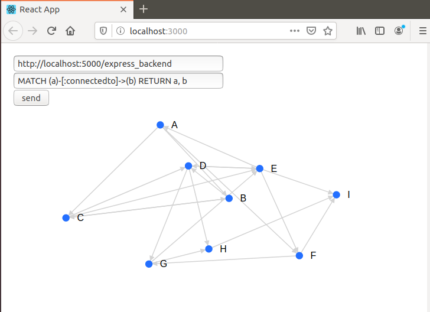

# Redis Graph Visualisation
[__redisgraph__](https://oss.redislabs.com/redisgraph/) is a __highly performant graph database__ that runs in memory and can be accessed using the __Cypher query language__. This is an open source tool, built with __React js__ and __Express backend__ to visualise this graph data. We shall be looking at how to set it up.

__Note that this entire process was done on ubuntu.__

## Step 1: Set up redisgraph

You need __docker__ installed for this step. If not, then follow [this guide](https://phoenixnap.com/kb/how-to-install-docker-on-ubuntu-18-04).
Next, you need to set up Redis-server and cli. For this, follow steps 1 and 2 of [this guide](https://www.digitalocean.com/community/tutorials/how-to-install-and-secure-redis-on-ubuntu-18-04).

__Ensure that you stop the redis server after testing it. We need the port free for the redisgraph server.__

